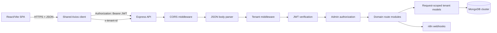
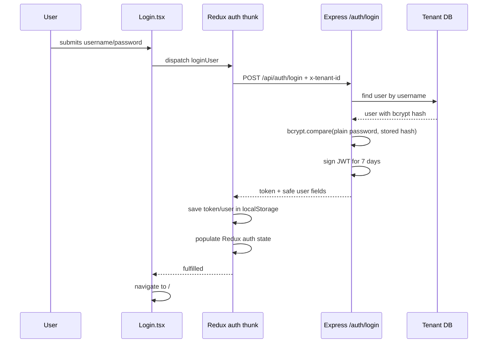
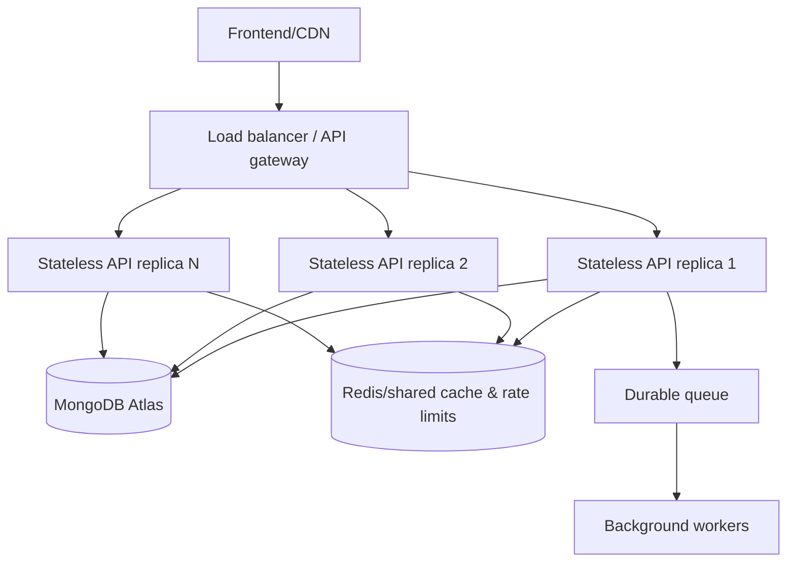

# HMCV — Complete Architecture Handoff

> **Purpose of this document**  
> This is a self-contained technical handoff for discussing the HMCV architecture with an AI assistant or a software architect who does not have access to the repository. It describes what the code does **now**, what is only partially implemented, the known risks, and the likely evolution path. It deliberately contains no passwords, database URLs, JWT secrets, or other secret values.

## 0. Instructions for the AI reading this document

Treat this document as a snapshot of the actual repository on **2026-10-06**. Do not assume that every item described as a future recommendation is already implemented.

When discussing changes:

1. Separate the current implementation from the proposed architecture.
2. Preserve tenant isolation and financial history.
3. Do not recommend storing derived `paid` or `remaining` values back on a trainee.
4. Treat the payment ledger as the financial source of truth.
5. Treat frontend route guards as user experience only, never as security.
6. Remember that the local server runs using Bun, while the current Vercel backend configuration uses `@vercel/node`.
7. Point out migration, authorization, concurrency, or data-integrity risks before suggesting deployment.
8. Ask for the relevant source file before proposing an exact patch if this document does not contain enough implementation detail.

---

## 1. Project summary

HMCV, or Hustle Muscle Club Manager, is a bilingual gym-management SaaS-style application. It manages:

- tenant-specific users and administrators;
- trainees and memberships;
- time-based and session-based subscriptions;
- check-ins and attendance history;
- membership freezing and unfreezing;
- payments, refunds, adjustments, and outstanding debt;
- coupons;
- trainers and salaries;
- expenses;
- dashboards and business reporting;
- CRM targeting and n8n webhook automation;
- administrative audit logs;
- a demo/customer-facing UI mode with visual feature locks.

The repository is a monorepo in the simple sense that it contains two separate applications:

```text
HMCV/
├── client/       React single-page application
├── server/       Express API and MongoDB access
├── README.md     Operational/project documentation
└── ARCHITECTURE_HANDOFF.md
```

It is currently a **modular monolith**, not a microservice system. There is one frontend application, one backend application, and one MongoDB cluster connection. The backend selects a separate MongoDB database for each tenant.

---

## 2. Current Git and release model

There are two long-lived branches:

- `main`: the owner's development/integration branch. It should contain every feature and should not visually lock premium features.
- `Deploy`: the customer-facing/demo branch connected to Vercel. Its UI can enable demo locks.

Before the finance release commit described by this handoff, both branch pointers were at:

```text
51893d3 fix: keep Vercel alive on database connection failure
```

The finance refactor and this handoff are being committed to `main` together. Therefore, after that push:

- the finance architecture described here represents `main`;
- `Deploy` remains at the earlier release until deliberately promoted;
- the deployed customer/demo application does not receive these changes merely because `main` was pushed;
- migration and data verification must happen before promoting the ledger-only code to `Deploy`.

The intended release workflow is:

```text
feature work → main → build/tests/migration verification → approved commit → Deploy → Vercel
```

The demo/full distinction is designed to be configuration-driven through:

```dotenv
VITE_DEMO_MODE=true|false
```

The frontend component `DemoFeatureGate` reads that build-time flag. This means the same source can theoretically be built as a full product or as a visually restricted demo. At present, demo protection is primarily a frontend presentation concern, not a separate backend authorization system.

---

## 3. Technology stack

### 3.1 Frontend

- React 18
- TypeScript
- Vite 5
- Redux Toolkit and React Redux
- React Router
- Axios
- React Hook Form and Yup
- Tailwind CSS
- Chart.js, React Chart.js, and Recharts
- i18next and React i18next
- React Hot Toast
- Lucide and Font Awesome icons
- Bun as the package manager and script runner

### 3.2 Backend

- TypeScript
- Express 4
- Mongoose 8
- MongoDB / MongoDB Atlas
- JSON Web Tokens using `jsonwebtoken`
- bcrypt password hashing
- Luxon for gym-timezone calculations
- Axios for n8n webhook calls
- Bun locally for development, tests, and startup
- TypeScript compiler for a static build check

### 3.3 Hosting as currently configured

- frontend: Vercel static Vite deployment;
- backend: Vercel function built by `@vercel/node` from `server/server.ts`;
- database: MongoDB Atlas or another MongoDB URI provided through `DB_URI`;
- optional workflow automation: n8n webhooks.

Important distinction: installing and using Bun locally does **not** mean the deployed Vercel backend runs in a persistent Bun process. The checked-in `server/vercel.json` explicitly selects `@vercel/node`.

---

## 4. High-level architecture



There are four important boundaries:

1. **Browser boundary**: Redux state and local storage live in the user's browser and cannot be trusted as security evidence.
2. **Authentication boundary**: the API verifies the signed JWT and loads the current user from the tenant database.
3. **Authorization boundary**: most management route groups require the current database user's role to be `admin`.
4. **Tenant boundary**: the `x-tenant-id` header selects the database used by every request-scoped model.

---

## 5. End-to-end request journey

A typical authenticated API call follows this exact conceptual path:

```text
React component
  ↓ dispatches Redux async thunk or calls shared Axios instance
client/src/utils/api.ts
  ↓ adds JWT from localStorage
  ↓ derives and adds x-tenant-id
Vercel/domain/network
  ↓
server/server.ts
  ↓ CORS validates browser origin and preflight headers
  ↓ bodyParser parses JSON
  ↓ tenantMiddleware selects gym_client_<tenantId>
  ↓ route group is selected
  ↓ verifyToken validates JWT and reloads user from selected tenant DB
  ↓ requireAdmin checks the fresh role for management APIs
  ↓ route uses db(req) to obtain tenant-specific Mongoose models
  ↓ service/domain logic runs
  ↓ MongoDB is queried or updated
  ↓ JSON response returns
Redux slice/component
  ↓ updates memory state and rerenders UI
```

The route may fail at several distinct layers:

- browser CORS/preflight;
- missing or wrong tenant header;
- invalid, absent, or expired JWT;
- user no longer exists in that tenant database;
- user is not an admin;
- domain validation, such as overpayment or expired subscription;
- MongoDB connectivity or query failure;
- external n8n failure.

---

## 6. Frontend architecture

### 6.1 Application boot

`client/src/main.tsx` mounts the React application. `App.tsx` provides:

- the Redux store;
- an error boundary;
- the toast container;
- `BrowserRouter`;
- route definitions;
- the initial session restoration call;
- a global dashboard data loader.

On application mount, `AppContent` dispatches:

```ts
dispatch(restoreSession());
```

This is what restores authentication after a hard refresh. Redux memory is empty after a refresh, so the application must use the saved token to rebuild trusted in-memory state.

### 6.2 Routes and layouts

Public routes:

| Frontend path | Behavior |
|---|---|
| `/auth/login` | Login screen |
| `/auth/register` | Redirects to login; public registration is disabled |

Protected layout:

```tsx
<ProtectedRoute>
  <Navbar />
</ProtectedRoute>
```

`Navbar` is not merely a navigation bar. It is the layout component and renders React Router's `<Outlet />`, so all nested protected screens appear inside it.

Protected pages:

| Path | Screen |
|---|---|
| `/` | Dashboard |
| `/trainers` | Trainer management |
| `/trainees` | Subscription management |
| `/expenses` | Expense management |
| `/allTrainees` | Detailed trainee list |
| `/crm` | CRM manager |
| `/settings` | User/admin settings |
| `/audit-logs` | Audit log viewer, additionally wrapped in `AdminRoute` |

Unknown paths redirect to `/` if Redux says the user is authenticated; otherwise they redirect to `/auth/login`.

### 6.3 ProtectedRoute

The authentication slice has an `initialized` flag. Before `/auth/me` completes, `ProtectedRoute` displays `Verifying session…`. This prevents the common refresh bug where the app redirects to login before it has had time to verify the stored token.

The decisions are:

```text
initialized = false                 → show verification screen
initialized = true, unauthenticated → redirect to login
initialized = true, authenticated   → render children
```

### 6.4 AdminRoute

`AdminRoute` reads the Redux user and checks `user.role === 'admin'`. A non-admin is redirected to `/`.

This is useful for navigation and user experience, but it is **not a security control**. A user can modify browser state or call APIs outside the UI. Real authorization must remain on the backend.

### 6.5 Redux store

The store currently contains these slices:

| Redux key | Responsibility |
|---|---|
| `auth` | user, token, authentication, initialization, login errors |
| `trainees` | trainee list, pagination, subscription mutations |
| `expenses` | expense collection and CRUD state |
| `trainers` | trainer collection and CRUD state |
| `user` | user/admin management |
| `dashboard` | shared raw dashboard data and refresh invalidation |
| `coupons` | coupon CRUD and validation |

Most server communication is implemented using Redux Toolkit `createAsyncThunk` functions.

### 6.6 Global dashboard data strategy

`GlobalDataLoader` watches:

- `auth.isAuthenticated`;
- `dashboard.raw`;
- `dashboard.needsRefresh`.

After authentication, it loads `/dashboard/raw-data`. Mutations such as trainee creation, renewal, check-in, freeze, expense changes, and trainer changes set `needsRefresh = true`. The loader then performs a background refresh while leaving the old data visible, preventing loading flicker.

Current limitation: this is broad invalidation and refetching, not normalized caching. The dashboard raw-data endpoint can become expensive as tenant data grows.

### 6.7 Shared Axios client

The shared client lives in `client/src/utils/api.ts`.

Base URL:

```ts
import.meta.env.VITE_API_URL || 'http://localhost:5000/api'
```

Before every request, an interceptor:

1. reads `authToken` from local storage;
2. sends it as `Authorization: Bearer <token>` when present;
3. resolves a tenant ID;
4. sends `x-tenant-id: <tenant>`.

Tenant resolution order:

```text
VITE_DEFAULT_TENANT exists → use it
localhost/127.0.0.1        → use HMCV
hostname has a subdomain   → use the first hostname segment
otherwise                  → use public
```

Example:

```text
gym1.example.com → gym1
localhost        → HMCV
example.com      → public
```

On a non-login `401`, the response interceptor currently calls `localStorage.clear()` and assigns `window.location.href = '/auth/login'`.

Known concerns:

- `localStorage.clear()` removes unrelated application/browser-origin storage too; it should normally remove only auth keys.
- direct `window.location.href` causes a full page reload; a React Router-aware auth event/redirect would be cleaner.
- the interceptor checks `window.location.pathname` only to avoid a login redirect loop; it is not route protection.
- deriving a security-sensitive tenant from a user-controlled hostname/header must be backed by server-side tenant authorization.

### 6.8 Authentication state and storage

Local storage keys:

```text
authToken
user
```

Redux keeps a convenient in-memory copy:

```ts
{
  user,
  token,
  loading,
  error,
  isAuthenticated,
  initialized
}
```

Why both exist:

- local storage survives refreshes;
- Redux provides reactive, fast state for components and route guards;
- the stored user object is only a cache and must not be treated as trusted;
- `/auth/me` returns a fresh user from the database, rebuilding Redux after refresh.

Current security tradeoff: a token in local storage is readable by JavaScript, so an XSS vulnerability could steal it. The current app does not use an HttpOnly cookie, refresh-token rotation, device sessions, or server-side token revocation.

### 6.9 Demo feature gate

`DemoFeatureGate` checks `features.demoMode`, which is derived from `VITE_DEMO_MODE`.

When disabled, it returns the children normally. When enabled, it visually obscures/disables the wrapped UI and overlays a lock label. This is a reusable wrapper for customer/demo presentation.

It does not secure the corresponding API. Anyone who can obtain valid admin access can still call the backend unless backend policy is separately implemented.

### 6.10 Internationalization

The app supports Arabic and English using i18next. `App.tsx` updates:

- `<html lang>`;
- `<html dir="rtl|ltr">`;
- the selected font family.

The translation files are in `client/src/locales/ar.json` and `en.json`.

---

## 7. Authentication lifecycle in detail

### 7.1 Login



The password submitted during login is not hashed and compared as two independently generated hashes. bcrypt salts make that unreliable. Instead, `bcrypt.compare` checks the plain submitted password against the existing salted hash.

The JWT payload contains:

```ts
{
  id: user._id,
  username: user.username,
  role: user.role
}
```

It expires after seven days. The API response exposes only `_id`, `username`, and `role`, not the password hash.

### 7.2 Page refresh and restoreSession

After a page refresh:

1. Redux begins empty and `initialized` is false.
2. `restoreSession` reads the token from local storage.
3. If no token exists, restoration is rejected and auth storage is cleared.
4. If a token exists, Axios calls `GET /api/auth/me`.
5. Tenant middleware selects the database from `x-tenant-id`.
6. `verifyToken` checks signature and expiration.
7. It uses the decoded ID to load the current user from that tenant database.
8. `/auth/me` returns the fresh username and role.
9. Redux is rebuilt using that user plus the existing token.

This design means a role change or user deletion takes effect on the next protected request because `verifyToken` queries the user every time.

There is no refresh token. `/auth/me` does not issue a new JWT or extend its seven-day lifetime.

### 7.3 Backend verification

`verifyToken` performs:

```text
read Bearer token
→ jwt.verify using JWT_SECRET
→ User.findById(decoded.id) in selected tenant DB
→ set req.user from fresh DB values
→ next()
```

Outcomes:

- no token: `401`;
- expired token: `401`;
- malformed/invalid token: `403`;
- missing user: `401`;
- unexpected verification/database failure: `500`.

### 7.4 Authorization

`requireAdmin` trusts `req.user`, not frontend state and not merely the stale role inside the JWT. It allows only `role === 'admin'`.

At the application mount level, all these route groups require both `verifyToken` and `requireAdmin`:

```text
/api/trainees
/api/coupons
/api/expenses
/api/trainers
/api/settings
/api/dashboard
/api/marketing
/api/audit-logs
```

Consequently, the current practical backend is mostly admin-only. The `user` role exists in the model but has very little useful API access.

### 7.5 Current authorization vulnerabilities

The `/api/auth` router is not globally admin-protected. Two routes need urgent review:

- `PUT /api/auth/:userId` requires a valid token but does not verify that the caller is that user or an admin.
- `DELETE /api/auth/deleteUser/:id` currently has no `verifyToken` or `requireAdmin` inside the route.

Because global tenant middleware still runs, those routes are tenant-scoped, but that is not adequate authorization. They should be fixed before production.

The `/api/settings` routes are admin-protected at the mount point, although the route file redundantly applies `verifyToken` again.

---

## 8. Tenant architecture

### 8.1 Current isolation model: database per tenant

Every request must contain:

```http
x-tenant-id: <tenant identifier>
```

`tenantMiddleware` constructs:

```ts
const dbName = `gym_client_${tenantId}`;
```

It then uses:

```ts
mongoose.connection.useDb(dbName, { useCache: true })
```

The result is one logical MongoDB database per tenant on the same base cluster/client connection.

Conceptually:

```text
MongoDB cluster
├── gym_client_HMCV
│   ├── users
│   ├── trainees
│   ├── paymenttransactions
│   └── ...
├── gym_client_demo
│   ├── users
│   ├── trainees
│   └── ...
└── gym_client_customer_x
    └── ...
```

### 8.2 Request-scoped models

The middleware attaches a generic function to the Express request:

```ts
req.getModel(modelName, schema)
```

`server/src/models/index.ts` exposes `db(req)`, which creates a convenient model set:

```ts
const {
  Trainees,
  Trainers,
  Coupon,
  User,
  Expense,
  PaymentTransaction,
  AuditLog
} = db(req);
```

All route code should use these models. Importing a global Mongoose model directly risks querying the wrong/default database.

There is also a process-local model cache keyed by:

```text
<databaseName>_<modelName>
```

This avoids recompiling models for repeated requests in the same process.

### 8.3 Connection meaning

`useDb` does not create a unique database connection for each user request. It reuses the underlying MongoDB client/pool while switching logical database context. However:

- each backend process or serverless instance has its own MongoDB pool;
- horizontal scaling multiplies the possible connection count;
- tenant count, user count, HTTP concurrency, and database socket count are different measurements.

A capacity plan should budget approximately:

```text
maximum API instances × maximum pool size × number of independently connected clusters
```

### 8.4 Current tenant-security gap

The tenant ID is selected from a user-controlled header and the JWT does not contain a tenant claim. The server verifies that the JWT's user ID exists in the selected tenant, which provides some protection, but the tenant choice itself is not explicitly bound to the authenticated session.

The intended stronger design is:

1. resolve the tenant during login from a trusted domain/registry;
2. put an immutable tenant identifier in the signed JWT or server-side session;
3. on every request, compare that trusted tenant to the requested host/header;
4. reject mismatches;
5. use a central tenant registry that maps tenant ID to database name, cluster key, status, plan, and allowed domains.

### 8.5 Input validation gap

The live tenant middleware currently interpolates the header directly into a database name. It should apply an allowlist such as letters, numbers, underscore, and hyphen, and reject excessive lengths. The migration script has an identifier regex, but the live middleware currently does not.

### 8.6 Health endpoints are tenant-dependent

`tenantMiddleware` is mounted before `/health`, `/health/live`, and `/health/ready`. Therefore even health checks currently require `x-tenant-id`, although the health handlers do not use tenant models. This can surprise Vercel, load balancers, and uptime monitors. Health routes would normally be mounted before tenant resolution.

---

## 9. Backend composition and middleware order

`server/server.ts` performs these major actions:

1. loads environment variables;
2. forces DNS resolver `8.8.8.8`;
3. creates the Express app;
4. configures CORS;
5. enables JSON parsing;
6. starts a Mongoose connection using `DB_URI`;
7. mounts tenant middleware globally;
8. mounts seed/auth/domain routes;
9. mounts health routes;
10. mounts 404 and error handlers;
11. calls `app.listen`;
12. exports the Express app.

### 9.1 CORS

Allowed origins currently include:

- `https://hustlecv.vercel.app`;
- `http://localhost:5173`;
- comma-separated values from `CORS_ORIGINS`;
- Vercel preview origins matching `https://hustlecv-<suffix>.vercel.app`.

Allowed request headers:

```text
Content-Type
Authorization
x-tenant-id
```

Allowed methods:

```text
GET POST PUT DELETE PATCH OPTIONS
```

Credentials are enabled. The CORS package also handles preflight `OPTIONS` requests.

### 9.2 Mongo connection behavior

The code calls `mongoose.connect(DB_URI)` once at module startup and logs success or failure. A rejected connection is caught and logged instead of terminating the app. This was introduced so the Vercel function can remain alive, but it can also allow the API process to accept requests while database access is unavailable.

`/health/ready` checks `mongoose.connection.readyState === 1` and returns `503` when disconnected.

### 9.3 Error handling

There is a final JSON 404 handler and a final error handler. Many route modules also catch errors themselves. Response envelopes are not fully standardized: some routes return `message`, some return `error`, some return `data`, and some return a raw document.

The Axios interceptor compensates partly by looking for either `response.data.message` or `response.data.error`.

---

## 10. Database models

All model schemas are compiled per tenant using `db(req)`.

### 10.1 User

Fields:

| Field | Meaning |
|---|---|
| `username` | unique, trimmed login name |
| `password` | bcrypt hash, never plain password |
| `role` | `user` or `admin`; default `user` |
| `createdAt`, `updatedAt` | Mongoose timestamps |

There is no email, password-reset state, disabled flag, session list, MFA, or token version.

### 10.2 Trainee

Identity and membership:

- `_id`: MongoDB ObjectId;
- `memberId`: sequential number generated by finding the current maximum and adding one;
- `name`, `phone`;
- `subscriptionStartDate`, `subscriptionEndDate`;
- `billingCycleId`: UUID identifying the current subscription cycle;
- `totalCost`, `discount` in major units;
- `program` free text;
- `isSession`, `sessionsRemaining`.

Lifecycle:

- `deleteFlag`, `deletedAt`, `deletedBy` for soft deletion;
- `accountFreezeStatus`, `freezeStartDate`;
- `freezeHistory[]` with action, actor, reason, effective date, old/new end dates, and timestamp;
- `daysLeft`, currently persisted and recalculated by a pre-save hook;
- `attendanceHistory[]`, `lastAttendance`.

Discount/CRM:

- `appliedDiscount` snapshot;
- `usedCoupon`;
- `crmInfo.whatsappOptIn`;
- `crmInfo.lastMessageSent`;
- `crmInfo.lastMessageType`.

Important finance decision: `paid` and `remaining` are no longer part of the schema. They are derived from ledger transactions.

The schema enables Mongoose optimistic concurrency. This is used especially to detect concurrent freeze changes through a `VersionError`.

Potential concurrency issue: `memberId = max(memberId) + 1` is not atomic. Two simultaneous trainee creations can calculate the same member ID and one can fail its unique constraint. A counter collection or retry strategy would be stronger.

### 10.3 PaymentTransaction

Fields:

- `traineeId`;
- `billingCycleId`;
- `type`: `payment`, `refund`, or `adjustment`;
- `amountMinor`: positive integer;
- `currency`: default `EGP`;
- `status`: `posted` or `voided`;
- optional `reason` and `reference`;
- optional `createdBy`;
- timestamps.

Compound query index:

```text
traineeId + billingCycleId + createdAt descending
```

Transactions are intended as immutable financial events. The current API creates and reads them; there is no normal edit/delete endpoint and no implemented void endpoint in the public route list.

### 10.4 AuditLog

Fields:

- `action`;
- `entity`;
- `entityId`;
- optional `actorUserId`;
- optional `requestId`;
- optional `before` snapshot;
- optional `after` snapshot;
- `createdAt` only.

### 10.5 Coupon

Fields:

- uppercase unique `code`;
- `discountType`: `PERCENTAGE` or `FIXED`;
- `value`;
- `expiryDate`;
- `isActive`;
- optional `usageLimit`;
- `usedCount`;
- timestamps.

Coupon redemption uses an atomic conditional increment so an exhausted coupon should not be consumed past its limit in the normal redemption path.

### 10.6 Expense

Fields:

- `name`;
- enumerated `category`;
- `amount` in major units;
- `dateOfPayment`;
- optional `description`;
- soft-delete fields;
- timestamps.

Unlike payment transactions, expenses currently store a decimal/number major-unit amount. This is a cross-domain money representation inconsistency worth fixing eventually.

### 10.7 Trainer

Fields:

- `name`;
- numeric `phone`;
- `salary`;
- `raise`;
- `deleteFlag`;
- timestamps.

The virtual `salaryAfterDiscount` returns:

```text
salary - raise
```

Despite its name, `raise` is currently treated as a deduction. This naming/business-rule inconsistency should be clarified.

---

## 11. Financial architecture

### 11.1 Source of truth

The system is moving from mutable trainee snapshots:

```text
trainee.paid
trainee.remaining
```

to an event ledger:

```text
PaymentTransaction[]
```

The trainee stores the subscription price and current `billingCycleId`. The transaction collection stores what financially happened. The API derives the current balance each time it returns a trainee or financial summary.

This avoids inconsistencies such as changing `paid` but forgetting to change `remaining`, and it preserves financial history.

### 11.2 Minor units

Ledger money is stored as integer minor units:

```text
100.00 EGP → 10000
75.50 EGP  → 7550
```

Reasons:

- decimal fractions are not exactly representable in binary floating point;
- equality and aggregation are deterministic;
- validation can require integers;
- payments and refunds avoid rounding drift.

The conversion is:

```ts
Math.round(amount * 100)
```

The UI converts back with:

```ts
amountMinor / 100
```

### 11.3 Ledger formulas

Only transactions with `status === 'posted'` count.

```text
grossPaidMinor   = sum(payment.amountMinor)
refundedMinor    = sum(refund.amountMinor)
adjustmentsMinor = sum(adjustment.amountMinor)

netPaidMinor = grossPaidMinor - refundedMinor + adjustmentsMinor

netPriceMinor = round(max(0, totalCost - discount) × 100)

outstandingMinor = max(0, netPriceMinor - netPaidMinor)
```

A negative net-paid balance is rejected by the calculator.

Current semantic note: an `adjustment` is always added because `amountMinor` must be positive. There is no explicit positive/negative direction field. Negative corrections currently need to be represented as refunds or the model should be redesigned.

### 11.4 LedgerSummary

The API attaches a derived object to trainee responses:

```ts
interface LedgerSummary {
  grossPaidMinor: number;
  refundedMinor: number;
  adjustmentsMinor: number;
  netPaidMinor: number;
  outstandingMinor: number;
}
```

This summary is **not stored on the trainee**. It is calculated from the current cycle's posted transactions. This ensures a single financial source of truth.

### 11.5 Why billingCycleId exists

A trainee can renew many times. Without a cycle boundary, last month's payment would count against this month's new subscription.

Example:

```text
January subscription price: 1000 EGP
January payment:            1000 EGP

February renewal price:     1000 EGP
February payment initially:    0 EGP
```

If all lifetime payments were summed, February would incorrectly look fully paid. On renewal, a new random UUID is assigned:

```text
January transactions → billingCycleId A
February transactions → billingCycleId B
```

The current balance uses only transactions matching the trainee's current `billingCycleId`. The history endpoint still returns transactions from all cycles.

### 11.6 Trainee creation

Creating a trainee accepts `initialPaymentMinor`, defaulting to zero.

Flow:

1. calculate the next member ID;
2. optionally atomically redeem a coupon;
3. calculate discount and net subscription price;
4. create trainee with a generated billing cycle;
5. reject a negative/non-integer initial payment;
6. reject an initial payment greater than net price;
7. save trainee;
8. if initial payment is greater than zero, create a `payment` transaction;
9. calculate and return the ledger summary;
10. attempt the welcome n8n webhook.

Current consistency risk: coupon redemption, trainee save, and initial transaction creation are not wrapped in one MongoDB transaction. A failure between steps can leave partially completed state.

### 11.7 Recording financial activity

Endpoint:

```http
POST /api/trainees/:id/transactions
```

Accepted types:

- `payment`;
- `refund`;
- `adjustment`.

Rules:

- amount must become a positive integer minor-unit value;
- payment or adjustment cannot exceed current outstanding balance;
- refund cannot exceed current net paid balance;
- the transaction is assigned to the current billing cycle;
- the authenticated actor is stored in `createdBy`;
- an audit record is created;
- a newly calculated summary is returned.

### 11.8 Updating price

When subscription fields are edited, the route checks the current ledger summary. The new effective price must not be less than money already collected. This protects the ledger from creating an accidental overpayment state by editing `totalCost` downward.

### 11.9 Renewal

Renewal changes membership dates/details and creates a new `billingCycleId`. It optionally accepts `paymentAmountMinor` for the new cycle. The old transactions remain unchanged and available as history.

The fundamental invariant is:

```text
one trainee identity
many subscription billing cycles
many immutable financial events per cycle
one derived summary for the current cycle
```

### 11.10 Pay Full and debt UI

The frontend no longer trusts `paid` or `remaining`. “Pay Full” sends exactly:

```text
trainee.ledgerSummary.outstandingMinor
```

The client helpers are:

```ts
toMajorUnits(amountMinor)
getNetCollected(trainee)
getOutstandingBalance(trainee)
```

### 11.11 Dashboard finance

Dashboard revenue is based on ledger transactions, not subscription prices and not legacy paid snapshots.

Conceptually:

```text
revenue = payments + adjustments - refunds
```

Only posted transactions should count. Expenses are subtracted to calculate profit. The frontend monthly business calculations also read the transaction list.

One frontend display helper currently includes only `payment` transactions in its recent income timeline, so refunds/adjustments may not be fully represented in that particular presentation.

### 11.12 Legacy payment migration — current state and warning

The migration is intended to:

1. find raw trainee documents that still contain `paid`, `remaining`, or `ledgerMigratedAt`;
2. preserve or generate a billing cycle ID;
3. inspect posted ledger transactions for that cycle;
4. if no transactions exist and legacy `paid > 0`, create one initial payment transaction;
5. detect conflicts where net ledger payment exceeds net price;
6. remove legacy fields;
7. default to dry-run and write only with `--apply`.

However, the current working file has a critical configuration mismatch:

```ts
const tenantId = "HMCV";
const databaseName = `HMCV`;
```

The live tenant middleware uses `gym_client_${tenantId}`. The script also says it requires `MIGRATION_TENANT_ID`, but currently does not read it. Therefore the migration may target `HMCV` while the application uses `gym_client_HMCV`.

**Do not run the apply migration until this is corrected and a successful dry run is reviewed against a backup.** A previous connectivity attempt also failed to reach MongoDB Atlas, so no successful database verification has been completed in this snapshot.

The correct intended pattern is:

```ts
const tenantId = process.env.MIGRATION_TENANT_ID;
const databaseName = `gym_client_${tenantId}`;
```

Deployment ordering matters:

```text
backup → fix migration target → staging dry-run → review conflicts
→ staging apply → reconcile totals → production dry-run per tenant
→ production apply → deploy ledger-only application
```

Deploying ledger-only code before migrating a legacy tenant can make previously paid members appear to owe their entire subscription price.

---

## 12. Membership and attendance rules

### 12.1 Check-in

Check-in rejects:

- invalid trainee IDs;
- missing trainees;
- frozen accounts;
- expired subscriptions;
- session subscriptions with zero sessions remaining;
- a second attendance on the same gym day.

For session subscriptions, one session is decremented. Debt currently produces a warning but does not block check-in.

The request updates:

- `lastAttendance`;
- `attendanceHistory`;
- `sessionsRemaining` when applicable.

### 12.2 Freeze

A membership cannot be newly frozen when:

- the subscription is expired;
- the current ledger summary has outstanding debt.

If the member already attended during the current Cairo gym day, freeze begins at the next gym day. Otherwise it begins at the current gym day.

### 12.3 Unfreeze

Unfreezing calculates elapsed frozen calendar days in `GYM_TIMEZONE` and extends the subscription end date by that number of days.

Both freeze and unfreeze append a history item and create an audit record. Optimistic concurrency can return `409` if another request changed the trainee first.

### 12.4 Timezone

Freeze-related day boundaries use Luxon and:

```text
GYM_TIMEZONE, default Africa/Cairo
```

Some other date calculations still use JavaScript local server time. Time handling is not yet uniformly centralized across dashboard, expiry, attendance, and reporting.

---

## 13. API surface

All endpoints pass through global tenant middleware in the current order.

### 13.1 Health and initialization

| Method | Path | Authentication | Purpose |
|---|---|---|---|
| GET | `/health` | none, but tenant header currently required | process response |
| GET | `/health/live` | none, but tenant header currently required | liveness |
| GET | `/health/ready` | none, but tenant header currently required | Mongo connection readiness |
| POST | `/seed/init-tenant` | `x-system-secret` | create first tenant admin if none exists |

### 13.2 Auth

| Method | Path | Protection | Purpose |
|---|---|---|---|
| POST | `/api/auth/login` | login rate limiter | authenticate and issue JWT |
| GET | `/api/auth/me` | JWT | restore fresh user |
| POST | `/api/auth/create-admin` | JWT + admin | create an admin |
| PUT | `/api/auth/:userId` | JWT only | update username/password; authorization gap |
| DELETE | `/api/auth/deleteUser/:id` | currently none | delete user; critical authorization gap |

Public registration code remains commented out, and the frontend registration path redirects to login.

### 13.3 Trainees and subscriptions

The entire group is JWT + admin protected.

| Method | Path | Purpose |
|---|---|---|
| GET | `/api/trainees` | search, filter, paginate active/non-deleted trainees; attach summaries |
| POST | `/api/trainees` | create membership and optional initial payment |
| GET | `/api/trainees/:id` | fetch one trainee with current summary |
| PUT | `/api/trainees/:id` | update full editable membership details |
| PATCH | `/api/trainees/:id` | update allowed partial fields |
| DELETE | `/api/trainees/:id` | soft delete |
| POST | `/api/trainees/check-in/:id` | attendance/check-in |
| PUT | `/api/trainees/:id/freeze` | toggle freeze/unfreeze |
| POST | `/api/trainees/:id/renew` | new subscription cycle |
| POST | `/api/trainees/:id/transactions` | payment/refund/adjustment |
| GET | `/api/trainees/:id/transactions` | lifetime history + current-cycle summary |

### 13.4 Other management areas

All groups below are JWT + admin protected at the application mount point.

| Area | Endpoints |
|---|---|
| Coupons | list, create, delete, validate |
| Expenses | list active, create, update, soft delete |
| Trainers | list active, create, update, soft delete |
| Settings | list users, update user, delete user |
| Dashboard | raw data and aggregated stats |
| Marketing | trigger reminders, log communication, validate coupon |
| Audit | paginated/filterable audit log list |

---

## 14. Audit architecture

The server helper `recordAudit` creates an `AuditLog` document, optionally participating in a supplied Mongoose session.

Actions currently recorded are limited to:

- `payment.recorded`;
- `transaction.refund.recorded`;
- `transaction.adjustment.recorded`;
- `subscription.frozen`;
- `subscription.unfrozen`;
- `trainee.deleted`;
- `expense.deleted`.

Audit coverage is incomplete. It does not consistently cover login, user/role changes, trainee creation/edit, renewal, check-in, coupon changes, trainer changes, expense create/edit, failed sensitive actions, or migration operations.

The audit read endpoint supports:

- page;
- limit capped at 100;
- exact action filter;
- exact entity filter;
- newest-first order;
- populated actor username and role.

The frontend `/audit-logs` screen is admin-only in both frontend routing and backend route mounting. It renders before/after JSON snapshots and pagination.

`requestId` is supported in the schema/service and read from `x-request-id`, but the Axios client does not currently generate that header and the server has no request-ID middleware. Therefore it is usually absent unless supplied externally.

---

## 15. Dashboard and reporting

The backend exposes:

- `/api/dashboard/raw-data` for frontend calculations and views;
- `/api/dashboard/stats` for server-side aggregate cards/graphs.

The raw-data response includes trainees with ledger summaries, expenses, trainers, and recent transactions. The frontend uses it to calculate:

- monthly revenue;
- expenses plus salaries;
- profit;
- active users;
- total active members;
- ARPU;
- profit margin;
- simplified churn;
- new signups;
- peak attendance hours;
- recent activity.

The aggregated server dashboard calculates counts, attendance, debt, revenue, expenses, and profit. Revenue uses signed posted ledger transactions.

Current scaling concern: shipping broad raw collections to the browser and recalculating business analytics client-side will not scale indefinitely. The future contract should use server-side aggregation, pagination, fixed reporting definitions, and explicit timezone/range parameters.

---

## 16. CRM and n8n

CRM target types include:

- expiring soon;
- debt;
- absence.

Debt targets are determined from ledger summaries, not legacy trainee fields. Target records contain identifying/contact information and calculated amount due.

`trigger-reminders` sends a batch to `N8N_CAMPAIGN_WEBHOOK` with the n8n API secret in a `key` header. New trainee creation attempts `N8N_WELCOME_WEBHOOK`.

The trainee creation route catches and logs n8n failures after the trainee is saved. Therefore a webhook failure does not roll back trainee creation, which is usually the correct availability tradeoff, but there is no durable retry queue. A production architecture should send jobs to a queue/outbox and process them asynchronously.

`requireApi.ts` contains API-key middleware for n8n-style requests, but its actual use should be reviewed because the main marketing router is protected through JWT/admin at the route-group level.

---

## 17. Seed/tenant initialization

Endpoint:

```http
POST /seed/init-tenant
x-tenant-id: <tenant>
x-system-secret: <SYSTEM_SECRET>
```

Flow:

1. global tenant middleware selects the tenant database;
2. route compares `x-system-secret` with `SYSTEM_SECRET`;
3. checks whether an admin already exists;
4. reads `DEFAULT_ADMIN_USERNAME` and `DEFAULT_ADMIN_PASSWORD`;
5. bcrypt-hashes the password;
6. creates the first admin only when no admin exists.

The endpoint returns a successful initialization message even if the seed helper merely logs missing credentials and returns. Error signaling could be stricter. This highly privileged system-secret route should also have rate limiting, strong operational controls, and ideally be removed/disabled after onboarding.

---

## 18. Environment variables

Server variables referenced by the code:

```dotenv
DB_URI=<MongoDB connection URI>
JWT_SECRET=<long random JWT signing secret>
PORT=5000
NODE_ENV=development|production
GYM_TIMEZONE=Africa/Cairo
CORS_ORIGINS=<comma-separated origins>

DEFAULT_ADMIN_USERNAME=<initial admin name>
DEFAULT_ADMIN_PASSWORD=<initial admin password>
SYSTEM_SECRET=<tenant initialization secret>

N8N_API_SECRET=<shared webhook secret>
N8N_WELCOME_WEBHOOK=<welcome webhook URL>
N8N_CAMPAIGN_WEBHOOK=<campaign webhook URL>

MIGRATION_TENANT_ID=<intended migration target; currently ignored by buggy working script>
```

Client build variables:

```dotenv
VITE_API_URL=<API base ending in /api>
VITE_DEFAULT_TENANT=<explicit tenant ID>
VITE_DEMO_MODE=true|false
```

Vite variables are compiled into the frontend bundle and are public. They must never contain secrets.

---

## 19. Local and deployed runtime

### 19.1 Local

Typical commands:

```powershell
Set-Location server
bun install
bun run dev

Set-Location ..\client
bun install
bun run dev
```

The client defaults to `http://localhost:5000/api`. On localhost, Axios sends tenant `HMCV`, which the live middleware maps to database `gym_client_HMCV`.

### 19.2 Backend Vercel

`server/vercel.json` routes every request to `server.ts` and builds it with `@vercel/node`.

Risks/points to verify:

- serverless cold starts and Mongo connection reuse;
- the number of concurrent instances and aggregate Mongo pool size;
- use of `app.listen` in a serverless entry point;
- health endpoints requiring tenant headers;
- DNS override behavior;
- allowed production and preview origins;
- environment variables in the correct Vercel project/environment;
- API base URL in the frontend build;
- Atlas IP/network policy and DNS connectivity.

### 19.3 CORS request

For a browser login from Vercel, the preflight must permit:

```text
Origin: frontend domain
Method: POST
Headers: content-type, x-tenant-id
```

Subsequent protected calls also need `authorization` allowed. A missing CORS header can be caused by incorrect deployment, wrong Vercel project/branch, a platform response generated before Express, or an origin that does not match the allowlist—not only by the Express CORS code itself.

---

## 20. Scaling model and recommended evolution

### 20.1 Do not equate users with simultaneous load

Four thousand registered users do not imply four thousand concurrent database connections. Capacity depends on:

- requests per second;
- concurrent in-flight requests;
- request latency;
- query efficiency and indexes;
- background work;
- response sizes;
- CPU and memory;
- Mongo pool waits;
- peak traffic, not only averages.

Example: 4,000 active users making one request per minute is about 67 requests/second on average. At 200 ms average service time, that is roughly 14 concurrent in-flight requests before peak factors.

### 20.2 Near-term architecture

Keep the modular monolith and make it horizontally scalable:



Recommended next steps:

1. make API instances stateless;
2. move login rate limits and future distributed locks to Redis or another shared store;
3. move n8n calls, reminders, and heavy reports behind a durable queue/outbox;
4. deploy at least two API tasks/instances behind a load balancer if leaving serverless;
5. monitor p50/p95/p99 latency, errors, CPU, memory, pool wait, query time, and queue depth;
6. load-test realistic routes before buying infrastructure;
7. cap database pool sizes based on maximum replica count;
8. add graceful shutdown and readiness behavior for container deployment.

### 20.3 Tenant placement strategy

Do not create one container per customer by default. That increases deployment, patching, monitoring, idle cost, and operational complexity.

A practical hybrid future model:

- small/normal tenants share the same stateless API fleet and MongoDB cluster;
- a central tenant registry decides database/cluster placement;
- large or compliance-sensitive tenants can be moved to a dedicated database cluster and, only if justified, dedicated API resources;
- keep the tenant abstraction even for dedicated tenants so application code stays uniform.

For a few hundred tenants requiring isolation/customization, database-per-tenant can remain workable. If the platform grows to very large numbers of uniform small tenants, shared collections with a mandatory indexed `tenantId` may be operationally cheaper, but that is a major migration and is not needed merely because the API needs horizontal scaling.

### 20.4 What to split first

Do not begin with arbitrary microservices. The first natural separation is background work:

- notification campaigns;
- webhook delivery/retries;
- scheduled expiry/debt reminders;
- report generation;
- exports/imports.

Keep core trainee/subscription/finance mutations together until domain boundaries and traffic justify a split. Financial consistency is easier inside one well-structured service than across premature distributed services.

---

## 21. Tests and current verification status

The latest completed local checks for the finance work were:

- server TypeScript build: passed;
- client production build: passed;
- server tests: passed, 13 tests and 0 failures;
- diff whitespace check: passed except line-ending warnings.

Covered server behaviors include:

- ledger calculations;
- payments, refunds, adjustments, void exclusion, and invalid values;
- payment schema integer validation;
- expense validation;
- coupon discount caps;
- freeze calculations and timezone behavior;
- optimistic concurrency configuration.

Not adequately covered yet:

- database-backed integration tests for complete routes;
- multi-tenant isolation tests;
- authorization/security regression tests;
- MongoDB transaction/concurrency tests;
- browser end-to-end tests;
- Vercel deployment integration;
- Atlas-backed migration rehearsal;
- load and connection-pool tests;
- n8n retry/failure tests.

The production frontend bundle has also previously triggered Vite's large-chunk warning.

---

## 22. Known risks and technical debt, prioritized

### P0 — fix before production financial deployment

1. **Migration database mismatch**: current migration hardcodes `HMCV`, while live tenant middleware uses `gym_client_HMCV`.
2. **Legacy-data sequencing**: deploying ledger-only reads before migrating legacy balances can show false full debt.
3. **Unauthenticated user delete route**: `/api/auth/deleteUser/:id` needs backend authentication and authorization.
4. **Under-authorized auth update route**: `/api/auth/:userId` needs self-or-admin policy.
5. **Tenant/session binding**: bind the authenticated identity to an authorized tenant instead of trusting the header alone.
6. **Backups and reconciliation**: migration requires a verified backup, staging rehearsal, and before/after financial totals.

### P1 — production hardening

1. Wrap related financial/coupon/membership writes in MongoDB transactions or an explicit consistency strategy.
2. Make request validation consistent, preferably schema-based.
3. Standardize success and error envelopes.
4. Expand audit coverage and generate request IDs.
5. Move rate limiting to a shared store for horizontal deployments.
6. Add token revocation/session policy, password reset, and possibly HttpOnly-cookie auth.
7. Validate tenant ID format and use a tenant registry.
8. Place health endpoints before tenant middleware.
9. Replace broad raw dashboard payloads with server-side reports and pagination.
10. Centralize timezone behavior.
11. Set and monitor explicit MongoDB pool sizes/timeouts.
12. Implement monitoring, alerts, automated backup, and restore drills.

### P2 — design and maintainability

1. Normalize money representation for expenses and salaries, not only payment ledger entries.
2. Clarify `Trainer.raise`, which currently subtracts from salary.
3. Replace non-atomic member-ID generation.
4. Remove redundant middleware inside route modules.
5. Remove stale commented code and unused dependencies such as session middleware if not planned.
6. Improve frontend API caching/normalization.
7. Replace `localStorage.clear()` and full-page auth redirect.
8. Add code splitting and accessibility/RTL/mobile testing.
9. Decide whether ordinary non-admin users are a real supported role and define their permissions.
10. Create a transaction void/reversal policy rather than ever editing financial history.

---

## 23. Architectural invariants to preserve

Any redesign should preserve these rules unless deliberately replaced with a stronger documented model:

1. A request must never accidentally access another tenant's models.
2. Backend authorization is authoritative; frontend guards are convenience only.
3. Password hashes and secrets never go to the client.
4. Current user/role should be checked against the database, not trusted forever from Redux.
5. Financial events are append-only; corrections happen through refund/adjustment/void policy.
6. Balances are derived, not independently mutable snapshots.
7. Current-cycle debt uses the current `billingCycleId` only.
8. Historical cycles and transactions remain available.
9. Soft deletion preserves financially relevant entities/history.
10. A migration defaults to dry-run and never runs against an ambiguous tenant/database.
11. Webhook failure should not silently corrupt the main business transaction.
12. Scaling the API must not weaken tenant isolation.

---

## 24. Suggested target architecture, in phases

### Phase A — make the current system safe

- fix auth-route authorization;
- fix and rehearse ledger migration;
- bind JWT/session to tenant;
- validate all identifiers and payloads;
- expand audits;
- add integration and E2E tests;
- complete backups and restore tests.

### Phase B — improve operational reliability

- introduce tenant registry/control database;
- add observability and request IDs;
- add Redis/shared rate limiting;
- add queue/outbox workers;
- move analytics aggregation to backend;
- define explicit connection-pool settings;
- deploy multiple stateless replicas or validate serverless concurrency behavior.

### Phase C — scale tenant placement

- assign tenants to cluster keys through the registry;
- keep shared clusters for normal tenants;
- isolate noisy/enterprise tenants when metrics justify it;
- introduce dedicated API capacity only for contractual/performance/compliance reasons;
- consider shared-collection tenancy only if tenant count and operational overhead make database-per-tenant unsuitable.

### Phase D — split services only when justified

- workers/notifications first;
- reporting/export service if workloads are heavy;
- identity/control plane if multiple products need it;
- avoid splitting the core financial write path until transaction boundaries are explicit.

---

## 25. Questions that still require product decisions

1. Is the `user` role meant for employees with limited permissions, or will all users remain admins?
2. Should demo mode only hide UI, or must it enforce backend feature restrictions too?
3. Can a user belong to multiple tenants?
4. Will tenants use subdomains, custom domains, explicit tenant selection, or all three?
5. Is EGP the only currency, and are two decimal minor units always correct?
6. What exactly should an `adjustment` mean: positive credit only, or signed correction?
7. How should financial transactions be voided, approved, and audited?
8. Should refunds affect reported revenue by transaction date or original-payment date?
9. Is salary `raise` actually a deduction?
10. Can members check in while owing debt? Current behavior says yes with a warning.
11. What are the retention requirements for attendance, audit, and financial history?
12. What availability, RPO, RTO, and tenant-isolation promises will customers receive?
13. Which tenant is the permanent local owner tenant and which is the public demo tenant?
14. Should a renewal be allowed before the previous cycle is fully paid?
15. Who may create new tenants and how is onboarding secured after initial seeding?

---

## 26. Ready-to-use prompt for a new ChatGPT conversation

Copy this entire file into a new conversation, then add:

```text
You are acting as a senior software architect and security-minded backend engineer.

The document above is the current architecture of my real HMCV project. First, prove that you understand it by summarizing:
1. the exact current request flow,
2. the tenant isolation model,
3. the authentication and authorization boundaries,
4. the ledger and billing-cycle model,
5. the difference between current implementation and proposed scaling architecture.

Then help me evaluate the following question:
[WRITE MY QUESTION HERE]

Rules:
- Do not invent files or features that are not in the document.
- Clearly label current behavior, risk, and recommendation separately.
- Protect historical financial data and tenant isolation.
- Prefer an incremental modular-monolith evolution before microservices.
- If you recommend a migration, include safe ordering, rollback, reconciliation, and test strategy.
- If information is missing, ask focused questions instead of silently assuming it.
```

---

## 27. One-paragraph mental model

HMCV is currently a React/Redux SPA talking to an Express/Mongoose modular monolith. The browser attaches a local-storage JWT and a tenant header to Axios calls. The server first selects a tenant-specific MongoDB database, then verifies the token by loading the current user from that database, and then requires admin access for nearly all management APIs. Trainee subscription price lives on the trainee, while payments/refunds/adjustments live as immutable minor-unit ledger events separated by billing-cycle UUID; balances are derived from those events. The codebase is moving away from legacy `paid`/`remaining` snapshots but the migration must be fixed and run safely before deployment. Scaling should initially mean stateless API replicas, controlled Mongo pools, shared rate limits, background workers, and a tenant registry—not one server/container per customer and not premature microservices.
